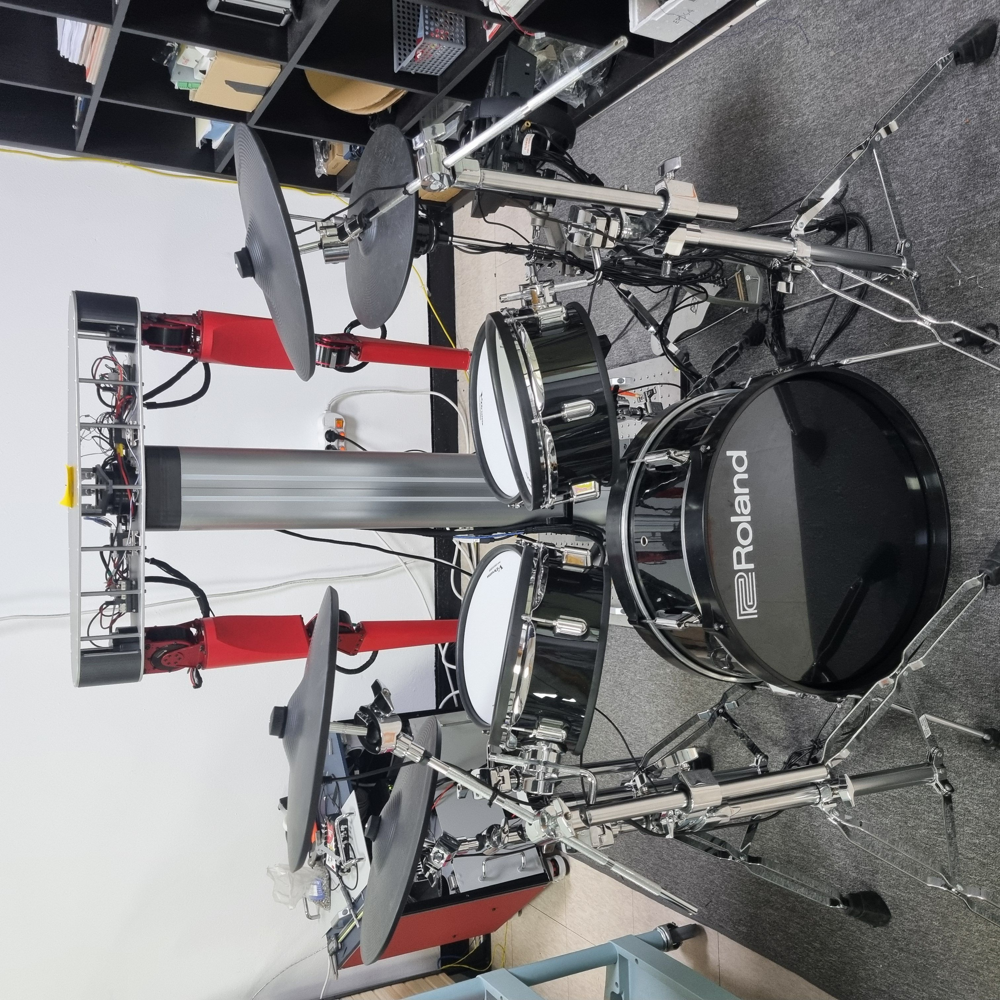
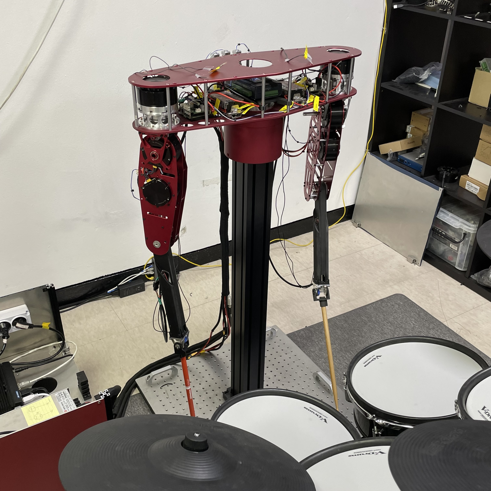
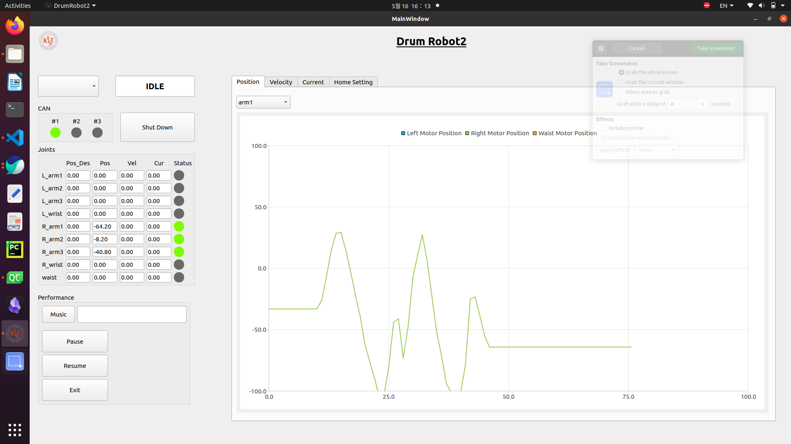

# DrumRobot2 KIST 인공지능연구단 드럼연주로봇 연구 및 개발

# Ubuntu-Based CAN Communication Robot Drummer
This project is a unique endeavor that leverages CAN communication to control nine motors within a Linux Ubuntu environment, enabling a robot to play drums. It's designed for music enthusiasts and tech aficionados alike, blending robotics with artistry to create rhythmic music.

## Features
- **Precision Motor Control**: Utilizing advanced algorithms in C++ to control Tmotor and Maxon motors with high precision, enabling accurate and dynamic drumming.
- **Real-Time System Performance**: Leveraging Linux Ubuntu with a Real-Time Kernel to ensure immediate response and consistent performance during drumming sequences.
- **Integrated User Interface**: A collaborative effort in Qt for GUI development, focusing on seamless integration between the control logic and user interface for intuitive user interaction.
- **Efficient Motor Communication**: Implementing the CAN Bus Protocol with SocketCAN Library for reliable and efficient communication between the control system and motors.
- **Robust Sensory Feedback**: Incorporating USB IO devices and proximity sensors for precise homing and positioning, enhancing the overall accuracy and consistency of the robot's movements.

## Technology Stack

### Software
- **C++**: Used for core algorithm development and motor control logic.
- **Linux Ubuntu with Real-Time Kernel**: Operating system platform modified for robust and stable performance with real-time capabilities.
- **Qt (GUI Development)**: Collaboratively developed with another developer, focusing on integrating the control logic with the GUI for enhanced user interaction.
- **SocketCAN Library**: Employed for implementing the CAN Bus Protocol, facilitating efficient communication with the motors.
- **Multi-Threading**: Implemented throughout the system to manage concurrent processes effectively. This approach is crucial for real-time data processing, ensuring synchronized motor control and maintaining system stability under various operational conditions.

### Hardware
- **Tmotor AK10-9 and AK70-10 Motors**: High-performance motors used for precise and powerful drumming actions.
- **Maxon Motor (EPOS4 CAN compact 50/15)**: Integrated for precise motor control, contributing to the accuracy and consistency of the drumming robot.
- **USB IO Device**: Used exclusively for connecting and interfacing with sensors.
- **Proximity Sensors**: Employed for homing purposes, ensuring accurate positioning and movement of the robot.
- **Peak USBtoCAN Device**: Used to interface the system with CAN networks, ensuring reliable communication with motor controllers.

## Screenshots and Demo
Include some screenshots of your project in action, and/or links to demo videos.

### 🎥 **Check out the drum robot video playlist here:** [**Drum Robot Video Playlist Link**](https://www.youtube.com/playlist?list=PLZbG63B7tdmLVjM_1uWHxAeesx-kkmfXY)

## License
State the license under which the project is available. Example: This project is licensed under the MIT License - see the LICENSE.md file for details.
>>>>>>> feature : Reinitialized repository

Drum Robot2
├── DataPlot
│   └── dataplot.py
├── Doxyfile
├── Doxyfile_shy
├── DrumRobot
│   ├── DataPlot
│   │   └── dataplot.py
│   ├── Doxyfile
│   ├── Doxyfile_shy
│   ├── LICENSE
│   ├── Makefile
│   ├── Qt.txt
│   ├── README.md
│   ├── SW Manual.pdf
│   ├── bin
│   │   ├── main.out
│   │   └── test_0625.csv
│   ├── guitest
│   │   ├── client
│   │   ├── client.cpp
│   │   ├── protocol.h
│   │   ├── server
│   │   └── server.cpp
│   ├── image
│   │   ├── Qt.png
│   │   ├── Ready_Pos.jpg
│   │   └── Ready_Pos2.jpg
│   ├── include
│   │   ├── USBIO_advantech
│   │   │   ├── Automation.BDaq.jar
│   │   │   ├── USBIO_advantech.hpp
│   │   │   ├── bdaqctrl.h
│   │   │   └── compatibility.h
│   │   ├── codes
│   │   │   ├── codeBC_0.txt
│   │   │   ├── codeBC_1.txt
│   │   │   ├── codeEDET_0.txt
│   │   │   ├── codeEDET_1.txt
│   │   │   ├── codeMOY1_0.txt
│   │   │   ├── codeMOY1_1.txt
│   │   │   ├── codeMOY2_0.txt
│   │   │   └── codeMOY2_1.txt
│   │   ├── eigen-3.4.0
│   │   │   └── ...
│   │   ├── managers
│   │   │   ├── CanManager.hpp
│   │   │   ├── GuiManager.hpp
│   │   │   ├── PathManager.hpp
│   │   │   ├── TestManager.hpp
│   │   │   └── rT.txt
│   │   ├── motors
│   │   │   ├── CommandParser.hpp
│   │   │   └── Motor.hpp
│   │   ├── tasks
│   │   │   ├── DrumRobot.hpp
│   │   │   ├── Functions.hpp
│   │   │   └── SystemState.hpp
│   │   └── usbio
│   │       ├── Global.hpp
│   │       ├── ICPDAS_USBIO.hpp
│   │       ├── ThreadFun.hpp
│   │       ├── Timer.hpp
│   │       ├── USBIO_Comm.hpp
│   │       ├── USBIO_Device.hpp
│   │       └── USBIO_Object_Layout.hpp
│   ├── lib
│   │   ├── libUSBIO_32.a
│   │   ├── libUSBIO_32.so.1.0
│   │   ├── libUSBIO_64.a
│   │   ├── libUSBIO_64.so.1.0
│   │   ├── libUSBIO_arm.a
│   │   ├── libUSBIO_arm.so.1.0
│   │   ├── libUSBIO_arm64.a
│   │   └── libUSBIO_arm64.so.1.0
│   ├── obj
│   │   ├── CanManager.o
│   │   ├── CommandParser.o
│   │   ├── DrumRobot.o
│   │   ├── Functions.o
│   │   ├── GuiManager.o
│   │   ├── Motor.o
│   │   ├── PathManager.o
│   │   ├── TestManager.o
│   │   ├── USBIO_advantech.o
│   │   └── main.o
│   ├── scripts
│   │   ├── CANControllerSetup.sh
│   │   ├── insmod_module_platform.sh
│   │   ├── ipdown_RDCCAN.sh
│   │   ├── ipup_RDCCAN_06.sh
│   │   ├── rmmod_module_platform.sh
│   │   └── sudo-gdb.sh
│   └── src
│       ├── CanManager.cpp
│       ├── CommandParser.cpp
│       ├── DrumRobot.cpp
│       ├── Functions.cpp
│       ├── GuiManager.cpp
│       ├── Motor.cpp
│       ├── PathManager.cpp
│       ├── TestManager.cpp
│       ├── USBIO_advantech.cpp
│       └── main.cpp
├── LICENSE
├── Makefile
├── Qt.txt
├── README.md
├── SW Manual.pdf
├── bin
│   └── main.out
├── guitest
│   ├── client
│   ├── client.cpp
│   ├── protocol.h
│   ├── server
│   └── server.cpp
├── image
│   ├── Qt.png
│   ├── Ready_Pos.jpg
│   └── Ready_Pos2.jpg
├── include
│   ├── USBIO_advantech
│   │   ├── Automation.BDaq.jar
│   │   ├── USBIO_advantech.hpp
│   │   ├── bdaqctrl.h
│   │   └── compatibility.h
│   ├── codes
│   │   ├── codeBC_0.txt
│   │   ├── codeBC_1.txt
│   │   ├── codeEDET_0.txt
│   │   ├── codeEDET_1.txt
│   │   ├── codeMOY1_0.txt
│   │   ├── codeMOY1_1.txt
│   │   ├── codeMOY2_0.txt
│   │   └── codeMOY2_1.txt
│   ├── eigen-3.4.0
│   │   └── ...
│   ├── managers
│   │   ├── CanManager.hpp
│   │   ├── GuiManager.hpp
│   │   ├── PathManager.hpp
│   │   ├── TestManager.hpp
│   │   └── rT.txt
│   ├── motors
│   │   ├── CommandParser.hpp
│   │   └── Motor.hpp
│   ├── tasks
│   │   ├── DrumRobot.hpp
│   │   ├── Functions.hpp
│   │   └── SystemState.hpp
│   └── usbio
│       ├── Global.hpp
│       ├── ICPDAS_USBIO.hpp
│       ├── ThreadFun.hpp
│       ├── Timer.hpp
│       ├── USBIO_Comm.hpp
│       ├── USBIO_Device.hpp
│       └── USBIO_Object_Layout.hpp
├── lib
│   ├── libUSBIO_32.a
│   ├── libUSBIO_32.so.1.0
│   ├── libUSBIO_64.a
│   ├── libUSBIO_64.so.1.0
│   ├── libUSBIO_arm.a
│   ├── libUSBIO_arm.so.1.0
│   ├── libUSBIO_arm64.a
│   └── libUSBIO_arm64.so.1.0
├── obj
│   ├── CanManager.o
│   ├── CommandParser.o
│   ├── DrumRobot.o
│   ├── Functions.o
│   ├── GuiManager.o
│   ├── Motor.o
│   ├── PathManager.o
│   ├── TestManager.o
│   ├── USBIO_advantech.o
│   └── main.o
├── scripts
│   ├── CANControllerSetup.sh
│   ├── insmod_module_platform.sh
│   ├── ipdown_RDCCAN.sh
│   ├── ipup_RDCCAN_06.sh
│   ├── rmmod_module_platform.sh
│   └── sudo-gdb.sh
└── src
    ├── CanManager.cpp
    ├── CommandParser.cpp
    ├── DrumRobot.cpp
    ├── Functions.cpp
    ├── GuiManager.cpp
    ├── Motor.cpp
    ├── PathManager.cpp
    ├── TestManager.cpp
    ├── USBIO_advantech.cpp
    └── main.cpp
