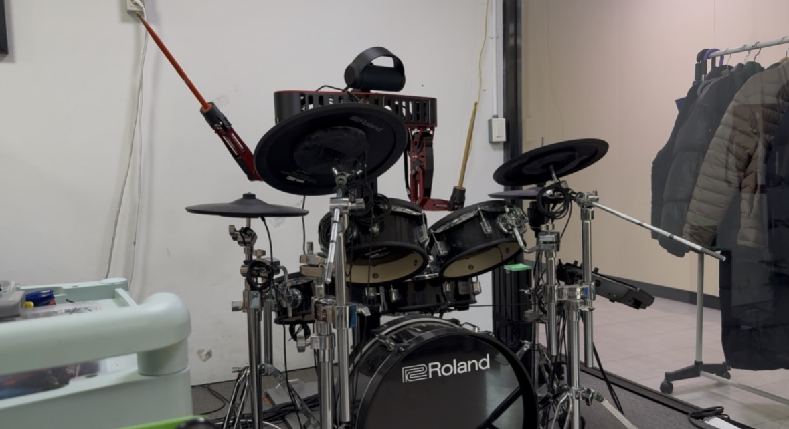

# Phil Robot / Drum Robot Project

Jetson AGX Orin 기반의 로컬 AI brain, C++ 로봇 제어기, frame-level SIL을 한 저장소에 모아 둔 드럼 로봇 프로젝트입니다.



현재 저장소의 공식 표현은 아래 흐름입니다.

```text
LLM 플래너 -> 로봇 제어기 -> frame-level SIL
```

- `phil_robot/`는 Whisper STT, Ollama 기반 Qwen classifier/planner, MeloTTS를 묶은 Python brain입니다.
- `DrumRobot2/`는 CAN/TMotor/Maxon/DXL 제어와 상태머신을 담당하는 C++ body입니다.
- `Drum_intheloop/`는 `DrumRobot2`의 SocketCAN `can_frame`과 Dynamixel serial packet을 그대로 받아 PyBullet에 적용하는 frame-level SIL 경로입니다.
- `legacy/phil_intheloop/`는 이전 simulator 경로를 보관하는 legacy 영역입니다.

## 현재 구조

```text
robot_project/
├── DrumRobot2/          # 실시간 C++ 로봇 제어기
├── Drum_intheloop/      # vcan/DXL PTY 기반 frame-level SIL
├── phil_robot/          # Python LLM brain / STT / TTS / eval
├── DrumRobot_data/      # 저장/생성 데이터와 코드 산출물
├── docs/                # 루트 문서 자산
├── legacy/              # 이전 자산 보관
└── log.md               # 작업 로그
```

### `DrumRobot2/`

- `src/main.cpp`: 제어기 엔트리포인트입니다. `initializeDrumRobot()`가 끝난 뒤에야 state/send/recv/music/python/broadcast thread를 시작합니다.
- `src/DrumRobot.cpp`: 로봇 상태머신, brain 대기, 초기 자세, state JSON broadcast, Magenta 연동 경로를 담당합니다.
- `src/AgentSocket.cpp`: TCP server를 열고 brain 명령 큐와 state JSON 송신을 처리합니다.
- `src/CanManager.cpp`: CAN 포트 초기화, 인터페이스 선택(real `can*` 우선, 없으면 `vcan*` fallback), 하드웨어 송수신을 담당합니다.
- `include/codes/*.txt`: 현재 드럼 악보 txt 파일 위치입니다. 첫 줄은 `bpm <number>` 형식이며, 이후 줄은 상대 대기시간과 손/발 악기 번호, velocity를 담습니다.

### `phil_robot/`

- `phil_brain.py`: 마이크 녹음, Whisper STT, 상태 스냅샷 조회, LLM 턴 실행, 검증된 명령 전송, TTS 재생을 묶는 메인 엔트리포인트입니다.
- `pipeline/`: classifier, planner, validator, skill expansion, motion resolver 같은 판단 계층입니다.
  - **LangGraph 기반 상태 기계(State Machine)**: `process → execute → return_home` 구조로 설계되어 비동기 실행 및 동작 간 전이를 유연하게 관리합니다.
  - **InterruptibleExecutor**: 백그라운드 스레드에서 로봇 명령을 실행하며, Enter 키 입력 시 이전 동작을 즉각 중단하고 새 명령을 처리합니다.
- `runtime/`: TCP client와 MeloTTS 같은 런타임 계층입니다.
- `eval/`: smoke case와 오프라인 평가 러너가 있습니다.
- `init_phil.sh`: `jetson_clocks`와 Ollama keep-alive를 이용해 Jetson 런타임을 예열합니다.

현재 기본 모델 설정은 아래 파일에 있습니다.

- classifier: `qwen3:4b-instruct-2507-q4_K_M`
- planner: `qwen3:30b-a3b-instruct-2507-q4_K_M`

### `Drum_intheloop/`

- `simul.py`: frame-level simulator 진입점입니다.
- `setup_sil.sh`: `vcan0..3`와 DXL용 PTY pair (`/dev/ttyUSB0`)를 준비합니다.
- `sil/decoder.py`, `sil/encoder.py`: TMotor/Maxon CAN frame과 Dynamixel Protocol 2.0 packet의 decode/encode를 담당합니다.
- `sil/router.py`: CAN ID/DXL ID를 motor와 joint로 라우팅합니다.
- `sil/mapping.py`: production motor 이름과 각도 의미를 URDF joint target으로 변환합니다.
- `sil/urdf_tools.py`: 체크인된 URDF/STL 원본을 건드리지 않고 runtime URDF patch를 적용합니다.
- 현재 backend는 `resetJointState()` 기반 즉시 반영 viewer에 가깝고, actuator dynamics는 모델링하지 않습니다.

## 빠른 시작

### 1. Python brain 환경

```bash
cd /home/shy/robot_project/phil_robot
conda env create -f environment.yml
conda activate drum4
```

추가로 Ollama 서버와 `phil_robot/config.py`에 적힌 Qwen 모델이 준비되어 있어야 합니다. `init_phil.sh`는 Jetson 환경에서 `jetson_clocks`와 Ollama keep-alive를 실행합니다.

### 2. C++ 제어기 빌드

```bash
cd /home/shy/robot_project/DrumRobot2
make clean
make
```

`Makefile`은 `opencv4`, `sfml`, `realsense2`, USBIO 라이브러리, Dynamixel 라이브러리가 있는 Jetson/Ubuntu 계열 환경을 전제로 합니다.

실행은 상대경로 의존성 때문에 `DrumRobot2/bin` 기준으로 하는 편이 안전합니다. CSV 로그는 `../../DrumRobot_data/`, 악보/음원/마젠타 산출물은 `../include/...`, `../magenta/...`를 전제로 합니다.

## 실행 모드

### 하드웨어 + brain

터미널 1:

```bash
cd /home/shy/robot_project/DrumRobot2/bin
sudo ./main.out
```

터미널 2:

```bash
cd /home/shy/robot_project/phil_robot
conda activate drum4
./init_phil.sh
python phil_brain.py
```

주의:

- `DrumRobot2`는 brain TCP 연결이 성공할 때까지 `initializeDrumRobot()` 안에서 대기합니다.
- brain이 연결되면 C++ 쪽이 내부적으로 `initializePos("o")`를 호출해 초기 자세 절차를 진행합니다.
- 그 다음에도 안전 키를 제거하고 C++ 터미널에서 `k`를 입력해 gate를 열기 전까지 명령은 폐기될 수 있습니다.
- state broadcast는 TCP `9999` 경로이며, SIL 경로와는 별개입니다.

### frame-level SIL

터미널 1 (vcan/DXL PTY 준비, 그대로 열어 둡니다):

```bash
cd /home/shy/robot_project/Drum_intheloop
sudo apt install -y iproute2 kmod can-utils socat
python3 -m pip install -r requirements.txt
./setup_sil.sh
```

터미널 2 (simulator):

```bash
cd /home/shy/robot_project/Drum_intheloop
python3 simul.py --mode gui
```

터미널 3 (`DrumRobot2`, 환경변수 없이 그대로 실행합니다):

```bash
cd /home/shy/robot_project/DrumRobot2/bin
sudo ./main.out
```

터미널 4 (brain):

```bash
cd /home/shy/robot_project/phil_robot
conda activate drum4
python phil_brain.py
```

중요:

- `DrumRobot2`는 real `can*` 인터페이스가 하나라도 있으면 real CAN만 사용하고, 없으면 `vcan*`로 fallback합니다. 별도 SIL 환경변수는 없습니다.
- `setup_sil.sh`는 `vcan0..3`와 `/dev/ttyUSB0` PTY를 만들어 둡니다. 실제 `/dev/ttyUSB0` 장치나 SIL이 만든 것이 아닌 symlink가 있으면 덮어쓰지 않고 중단합니다.
- TCP brain 연결은 별도이므로, simulator만 띄운다고 `main.out`의 전체 동작이 자동으로 시작되지는 않습니다.

## 평가와 보조 문서

- 오프라인 LLM 평가: `python phil_robot/eval/run_eval.py --suite smoke`
- Python brain 구조 문서: `phil_robot/docs/PROJECT_STRUCTURE_KR.md`
- LLM 파이프라인 문서: `phil_robot/docs/LLM_PIPELINE_ARCHITECTURE_KR.md`
- SIL 상세 문서: `Drum_intheloop/README.md`

## 재생 제어 및 안전 메커니즘 (Pause/Resume/Stop)

현재 로봇의 모터 제어 및 악보 재생은 전역 궤적 버퍼링(Global Trajectory Buffering)을 배제하고 **점진적 파일 기반 실행(Incremental File-Based Execution)** 모델을 사용합니다.

- 긴급 정지 및 일시정지(`s` 명령): 명령 수신 시 `std::mutex`로 보호되는 각 모터의 pending 버퍼(`PathManager`)와 `TestManager` 큐를 즉각 플러시하여 로봇이 추가 동작 없이 즉시 멈춥니다.
- 재생 재개(`p` 명령): 정지된 위치를 내부적으로 추적하여, 재시작 시 음악의 처음이 아닌 중단된 마디/위치부터 이어서(Resume) 재생합니다.

## 현재 문서화해 둘 제한 사항

- `main.cpp`는 `initializeDrumRobot()`가 끝난 뒤에야 주요 thread를 시작하므로, brain TCP 연결이 안 되면 이후 경로가 함께 지연될 수 있습니다.
- `openCSVFile()`은 startup 초기에 메타데이터를 기록하므로, CSV가 생겼다고 body trajectory 생성까지 성공한 것은 아닙니다.
- `legacy/phil_intheloop/`는 현재 공식 경로가 아니라 이전 자산 보관용입니다.

## 참고 이미지

- SIL GUI 예시: [Simulation_intheloop.png](./Drum_intheloop/artifacts/Simulation_intheloop.png)
- SIL GUI 예시 2: [SIL2.png](./Drum_intheloop/artifacts/SIL2.png)
